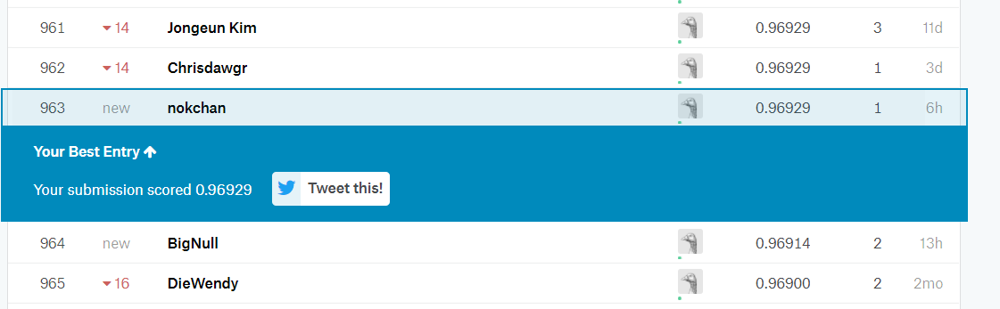

```python
## Kaggle Digital Recognizer Competition   Simple KNN
```





```python
import numpy as np
import matplotlib.pyplot as plt
import pandas as pd
import os
from collections import Counter
%matplotlib inline
```


```python
address = '\\data\\'
data_address = ''.join(os.getcwd() + address)
```

Load dataset from the downloaded file


```python
train = pd.read_csv(data_address +'train.csv')
test = pd.read_csv(data_address + 'test.csv')
```


```python
## The train dataset has one extra column for the label
print(train.shape)
train.head()

```


```python
print(test.shape)
test.head()
```


```python
train_label = train.label
train = train.drop('label', axis = 1) ## Drop the label column

print(train.shape) ## Check if the column is dropped
```


```python
train_labels = np.array(train_label)
train= np.array(train)
test = np.array(test)
```


```python
## Plot the training dataset
def plotmnist(index):
    plt.figure()
    plt.imshow(train[index].reshape(28,28), cmap = plt.cm.gray_r, interpolation ='nearest')
    plt.show()
```


```python
plotmnist(10)
```

Now that the data are ready, we can start writing a simple Nearest Neighbour algorithm to train the classifier. But first lets define some useful function to calculate distance between data points.


```python
def distance(sample, target): 
    return np.sqrt(np.sum((sample - target)**2 )) ## The generic formula of Euclidean Distance
```


```python
## A liitle check that our function is working.
a = np.array([1,4])
b = np.array([4,8])
distance(a,b)
```


```python
def nearest_neighbour(sample, target):
    #sample = np.array(sample)
    #target = np.array(target)
    dist_matrix = []
    
    ## Apply the distance function for each training sample, axis = 1 (column)
    
    return np.apply_along_axis(distance, 1,sample,target).argmin() ## Returning the index of the minimum distance
```


```python
p = nearest_neighbour(train,test[10])
```


```python
## Again, little quick check
a = np.array([[1,4],[3,10],[2,8],[3,7],[4,8]]) ## Expected answer is the 4th element as the distance is 0 (count from 0)
b = np.array([4,8])
nearest_neighbour(a,b)
```

### Now we can start running the algorihtm on training set with the Nearest Neighbour.


```python
def check_nearestneighbour(index):
    print('Predict: ' ,train_label[index])
    nearest_neighbour(train,test[index])
    plotmnist(index)
    
```


```python
## Sample Check
check_nearestneighbour(100)

```


```python
## Create a validation set to get an accuracy estimation
split_index  = int(len(train)*0.9)
train_set = train[:split_index,]
valid_set = train[split_index:,]
valid_label = train_labels[split_index:]
train_label = train_labels[:split_index]

```


```python
print(train_set.shape)
print(valid_set.shape)
```


```python
def valid_score(results,i):
    
    total = i
    count = sum(results== valid_label[:i])
    print('Correct: ',count,' | ','Total: ',total)
    print('Accuracy: ', 1.0 * count / total * 100 , '%')
    return 100.0*count/total
```


```python
valid_result = []

import time
start = time.time()

for i in range(100) :
    valid_result.append(train_label[nearest_neighbour(train_set, valid_set[i])])
    
end = time.time()
print('Time used for 100 samples: ', end - start, '(s)')
valid_score(valid_result,100)
```


```python
#### Instead of using the nearest_neighbour, using K nearest neighobour may improve boundary case.
def k_nearest_neighbour(sample, target, k):
    #sample = np.array(sample)
    #target = np.array(target)
    dist_matrix = []
    
    ## Apply the distance function for each training sample, axis = 1 (column)
    temp = tuple(zip(np.apply_along_axis(distance, 1,sample,target),range(len(sample))))
    temp_index = sorted(temp)
    temp_index = list(zip(*temp_index))[1][:k]  ## The closest k neighbour index
    temp_index = list(temp_index)   
  
    
    return  Counter(train_label[temp_index]).most_common(1)[0][0]
    ### The highest vote label.
```

### Now try the K nearest neighbour see if it improves or not, try a few K value,


```python
import time

for k in [3,5,7]:
    start = time.time()
    valid_result = []
    for i in range(100) :
        valid_result.append(k_nearest_neighbour(train_set, valid_set[i],k))
    
    end = time.time()
    print('Time used for 100 samples: ', end - start, '(s)')
    print('K neighbours: ',k)
    valid_score(valid_result,100)
```

### Because the distance matrix is the same for different K-values, we should really return the sorted closest distance matrix first and try different K values afterward to avoid recalculating the same distance matrix. So I write a similar function only for validation purpose so it return a list instead of a label directly.


```python
def k_nearest_neighbour_validation(sample, target): ## no k here because we will return the whole list first.
    #sample = np.array(sample)
    #target = np.array(target)
    dist_matrix = []
    
    ## Apply the distance function for each training sample, axis = 1 (column)
    temp = tuple(zip(np.apply_along_axis(distance, 1,sample,target),range(len(sample))))
    temp_index = sorted(temp)
    temp_index = list(zip(*temp_index))[1][:]  ## The closest k neighbour index
    temp_index = list(temp_index)   
  
    
    return  temp_index
    ### The highest vote label.
```


```python
distance_matrix = []
for i in range(len(valid_set)):
    distance_matrix.append(k_nearest_neighbour_validation(train_set, valid_set[i]))
```


```python
import pickle
with open("distancematrix.p", "wb") as output_file:
    e = pickle.dump(distance_matrix,output_file)
```


```python
len(valid_result)
```


```python
a=Counter(train_label[temp_index])
```


```python
a.most_common(1)[0][0]
```


```python
valid_result == valid_label[]
```


```python
import time
knn = [2,4,8,16,32,64,128,256,512]
accuracy = []
valid_results = []
for k  in knn:
    start = time.time()
    valid_result = []
    for i in range(len(distance_matrix)) :
        temp_index = distance_matrix[i][:k]
        valid_result.append(Counter(train_label[temp_index]).most_common(1)[0][0])
    valid_results.append(valid_result)
        
      
    
    end = time.time()
    print('Time used for 100 samples: ', end - start, '(s)|','K neighbours: ',k
         )
    
    accuracy.append(valid_score(valid_result,len(distance_matrix)))
    print('---'*10)
    
```


```python
##Accuracy go downs quite fast when N increas, so I will search the K in smaller number
plt.plot(knn,accuracy)
```


```python
import time
knn = range(1, 128)
accuracy = []
valid_results = []
for k  in knn:
    start = time.time()
    valid_result = []
    for i in range(len(distance_matrix)) :
        temp_index = distance_matrix[i][:k]
        valid_result.append(Counter(train_label[temp_index]).most_common(1)[0][0])
    valid_results.append(valid_result)
        
      
    
    end = time.time()
   
    
    accuracy.append(sum(valid_result==valid_label)/1.0/len(distance_matrix));
   
    
```


```python
## Seems 3-NN and 5-NN yield best result, I will use 3 for the final test set. It will takes few hours to run.
sorted(zip(accuracy,range(1,128)),reverse= True)[0:5]
```


```python
##Accuracy go downs quite fast when N increas, so I will search the K in smaller number
plt.plot(knn,accuracy)
```

## Larger 


```python
#### Similar function but using entire dataset instead of train set only, could have pass one more parameter for
#### which training set to use, but for easier debug purpose will keep different functions for now.
def k_nearest_neighbour_final(sample, target, k):
    #sample = np.array(sample)
    #target = np.array(target)
    dist_matrix = []
    
    ## Apply the distance function for each training sample, axis = 1 (column)
    temp = tuple(zip(np.apply_along_axis(distance, 1,sample,target),range(len(sample))))
    temp_index = sorted(temp)
    temp_index = list(zip(*temp_index))[1][:k]  ## The closest k neighbour index
    temp_index = list(temp_index)   
  
    
    return  Counter(train_labels[temp_index]).most_common(1)[0][0] ##train_labels is the full set
    ### The highest vote label.
```


```python
submit_result = []
start = time.time()
for i in range(test.shape[0]):
     ## Using entire dataset "train" not "train_set"
    submit_result.append(k_nearest_neighbour_final(train, test[i], 3))
    if i %100 == 0:
        end = time.time()
        print(i%100, '100s batch','Used time for 100 test data: ', end - start)
        start = end
```


```python

with open("sumbit.p", "wb") as output_file:
    e = pickle.dump(submit_result,output_file)
```


```python
len(submit_result)
```


```python
pd.DataFrame(submit_result).to_csv('result.csv')
```


```python
pd.DataFrame(submit_result)
```


```python

```
